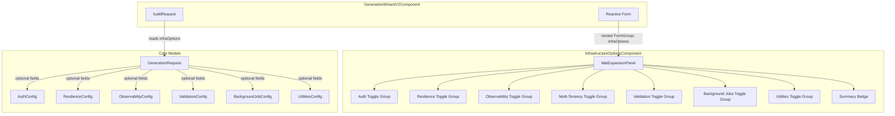

# Design Document: Forge UI Generation Toggles

## Overview

This design adds an "Infrastructure Options" collapsible section to the `GenerationWizardV2Component` that exposes fine-grained toggle controls for cross-cutting infrastructure concerns. The toggles map directly to the API's `AuthConfig`, `ResilienceConfig`, `ObservabilityConfig`, `ValidationConfig`, `BackgroundJobConfig`, `UtilitiesConfig`, and `MultiTenancy` fields already accepted by the Forge API.

### Key Design Decisions

1. **Standalone child component** — The infrastructure toggles are extracted into a dedicated `InfrastructureOptionsComponent` (standalone, Angular Material) rather than inlining into the already-large wizard component. The parent passes a `FormGroup` reference via `@Input()`.
2. **FormGroup nesting** — Infrastructure toggle state lives in a nested `FormGroup` (`infraOptions`) within the wizard's reactive form. This keeps the form tree organized and makes it trivial to detect "all defaults" by comparing the group's value to a known defaults object.
3. **Null-emission strategy** — When all toggles match their defaults, `buildRequest()` omits the infrastructure fields entirely (sends `undefined`/not-present in JSON). This ensures byte-identical payloads to pre-toggle behavior.
4. **Coming Soon toggles are disabled FormControls** — Disabled controls are excluded from `form.value` but included in `form.getRawValue()`. The mapping function hardcodes their values to `false` regardless.
5. **Cross-toggle validation via custom validators** — Validation rules (CloudWatch requires Serilog, Multi-Tenancy requires Database, External HTTP requires Resilience) are implemented as cross-field validators on the `infraOptions` FormGroup, evaluated reactively on every change.

## Architecture



### Data Flow

1. Wizard form initializes with `infraOptions` FormGroup containing all toggle controls at their default values
2. `InfrastructureOptionsComponent` renders the collapsible panel with toggle groups bound to the FormGroup
3. User modifies toggles → FormGroup value updates reactively → cross-field validators run
4. Summary badge computes non-default count from FormGroup value vs. defaults constant
5. On submit, `buildRequest()` reads `infraOptions` FormGroup value and maps to config interfaces
6. If all values match defaults, infrastructure fields are omitted from the request payload
7. If any value differs, the full config objects are included in the request

## Components and Interfaces

### InfrastructureOptionsComponent

A standalone Angular component that encapsulates the infrastructure toggles UI.

```typescript
@Component({
  selector: 'forge-infrastructure-options',
  standalone: true,
  imports: [
    CommonModule,
    ReactiveFormsModule,
    MatExpansionModule,
    MatCheckboxModule,
    MatRadioModule,
    MatIconModule,
    MatTooltipModule,
  ],
  changeDetection: ChangeDetectionStrategy.OnPush,
})
export class InfrastructureOptionsComponent {
  /** The nested FormGroup for infrastructure options, passed from parent */
  infraForm = input.required<FormGroup<InfraOptionsFormControls>>();

  /** Whether a database is configured (for multi-tenancy validation) */
  databaseConfigured = input<boolean>(false);

  /** Computed: number of toggles that differ from defaults */
  nonDefaultCount = computed(() => countNonDefaultToggles(this.infraForm().getRawValue()));
}
```

### InfraOptionsFormControls Interface

```typescript
export interface InfraOptionsFormControls {
  // Authentication
  apiKeyEnabled: FormControl<boolean>;
  jwtEnabled: FormControl<boolean>;
  mtlsEnabled: FormControl<boolean>;       // disabled — Coming Soon

  // Resilience
  retryEnabled: FormControl<boolean>;
  circuitBreakerEnabled: FormControl<boolean>;
  timeoutEnabled: FormControl<boolean>;
  internalHttpClient: FormControl<boolean>;
  externalHttpClient: FormControl<boolean>;

  // Observability
  serilogEnabled: FormControl<boolean>;
  cloudWatchEnabled: FormControl<boolean>;
  openTelemetryEnabled: FormControl<boolean>;
  correlationIdEnabled: FormControl<boolean>;
  prometheusEnabled: FormControl<boolean>;  // disabled — Coming Soon

  // Multi-Tenancy
  multiTenancy: FormControl<boolean>;

  // Validation
  fluentValidationEnabled: FormControl<boolean>;

  // Background Jobs
  backgroundJobProvider: FormControl<string | null>;

  // Utilities
  pdfEnabled: FormControl<boolean>;             // disabled — Coming Soon
  templateEngineEnabled: FormControl<boolean>;  // disabled — Coming Soon
  hashingEnabled: FormControl<boolean>;
}
```

### Default Values Constant

```typescript
export const INFRA_OPTIONS_DEFAULTS: InfraOptionsFormValue = {
  // Authentication
  apiKeyEnabled: true,
  jwtEnabled: false,
  mtlsEnabled: false,

  // Resilience
  retryEnabled: true,
  circuitBreakerEnabled: true,
  timeoutEnabled: true,
  internalHttpClient: true,
  externalHttpClient: false,

  // Observability
  serilogEnabled: true,
  cloudWatchEnabled: true,
  openTelemetryEnabled: true,
  correlationIdEnabled: true,
  prometheusEnabled: false,

  // Multi-Tenancy
  multiTenancy: false,

  // Validation
  fluentValidationEnabled: true,

  // Background Jobs
  backgroundJobProvider: null,

  // Utilities
  pdfEnabled: false,
  templateEngineEnabled: false,
  hashingEnabled: false,
};
```

### Mapping Functions (Pure)

```typescript
/**
 * Maps infrastructure form values to the GenerationRequest config fields.
 * Returns undefined for fields that match defaults (null-emission strategy).
 */
export function mapInfraOptionsToRequest(
  formValue: InfraOptionsFormValue
): InfraConfigPayload {
  const isAllDefaults = isInfraOptionsAtDefaults(formValue);

  if (isAllDefaults) {
    return {
      auth: undefined,
      resilience: undefined,
      observability: undefined,
      validation: undefined,
      backgroundJobs: undefined,
      utilities: undefined,
      multiTenancy: undefined,
    };
  }

  return {
    auth: {
      apiKeyEnabled: formValue.apiKeyEnabled,
      jwtEnabled: formValue.jwtEnabled,
      mtlsEnabled: false, // Coming Soon — always false
    },
    resilience: {
      retryEnabled: formValue.retryEnabled,
      circuitBreakerEnabled: formValue.circuitBreakerEnabled,
      timeoutEnabled: formValue.timeoutEnabled,
      internalHttpClient: formValue.internalHttpClient,
      externalHttpClient: formValue.externalHttpClient,
    },
    observability: {
      serilogEnabled: formValue.serilogEnabled,
      cloudWatchEnabled: formValue.cloudWatchEnabled,
      openTelemetryEnabled: formValue.openTelemetryEnabled,
      correlationIdEnabled: formValue.correlationIdEnabled,
      prometheusEnabled: false, // Coming Soon — always false
    },
    validation: {
      fluentValidationEnabled: formValue.fluentValidationEnabled,
    },
    backgroundJobs: {
      provider: formValue.backgroundJobProvider,
    },
    utilities: {
      pdfEnabled: false,             // Coming Soon — always false
      templateEngineEnabled: false,  // Coming Soon — always false
      hashingEnabled: formValue.hashingEnabled,
    },
    multiTenancy: formValue.multiTenancy,
  };
}

/**
 * Counts how many toggle values differ from their defaults.
 */
export function countNonDefaultToggles(formValue: InfraOptionsFormValue): number {
  const defaults = INFRA_OPTIONS_DEFAULTS;
  let count = 0;
  for (const key of Object.keys(defaults) as (keyof InfraOptionsFormValue)[]) {
    if (formValue[key] !== defaults[key]) {
      count++;
    }
  }
  return count;
}

/**
 * Returns true if all infrastructure options match their defaults.
 */
export function isInfraOptionsAtDefaults(formValue: InfraOptionsFormValue): boolean {
  return countNonDefaultToggles(formValue) === 0;
}
```

### Cross-Toggle Validator

```typescript
export function infraOptionsValidator(
  databaseConfiguredFn: () => boolean
): ValidatorFn {
  return (group: AbstractControl): ValidationErrors | null => {
    const value = group.value as InfraOptionsFormValue;
    const errors: Record<string, string> = {};

    // Rule 1: CloudWatch requires Serilog
    if (!value.serilogEnabled && value.cloudWatchEnabled) {
      errors['cloudWatchRequiresSerilog'] =
        'CloudWatch is a Serilog sink and cannot function without Serilog enabled.';
    }

    // Rule 2: Multi-Tenancy requires Database
    if (value.multiTenancy && !databaseConfiguredFn()) {
      errors['multiTenancyRequiresDatabase'] =
        'Multi-Tenancy requires a database configuration.';
    }

    // Rule 3: External HTTP Client requires Resilience
    if (value.externalHttpClient && !value.retryEnabled) {
      errors['externalHttpRequiresResilience'] =
        'External HTTP Client requires at least one resilience toggle enabled.';
    }

    return Object.keys(errors).length > 0 ? errors : null;
  };
}
```

### Extended GenerationRequest Interface

```typescript
export interface AuthConfig {
  apiKeyEnabled: boolean;
  jwtEnabled: boolean;
  mtlsEnabled: boolean;
}

export interface ResilienceConfig {
  retryEnabled: boolean;
  circuitBreakerEnabled: boolean;
  timeoutEnabled: boolean;
  internalHttpClient: boolean;
  externalHttpClient: boolean;
}

export interface ObservabilityConfig {
  serilogEnabled: boolean;
  cloudWatchEnabled: boolean;
  openTelemetryEnabled: boolean;
  correlationIdEnabled: boolean;
  prometheusEnabled: boolean;
}

export interface ValidationConfig {
  fluentValidationEnabled: boolean;
}

export interface BackgroundJobConfig {
  provider: string | null;
}

export interface UtilitiesConfig {
  pdfEnabled: boolean;
  templateEngineEnabled: boolean;
  hashingEnabled: boolean;
}

export interface GenerationRequest {
  verticalSlug: string;
  name: string;
  displayName: string;
  description: string;
  version: string;
  type: 'RestApi' | 'GraphQL' | 'Grpc' | 'AngularShell' | 'AngularMfe' | 'Monolithic' | 'Ionic';
  uiTargets?: ('web' | 'mobile')[];
  genesisModules: string[];
  canvasModules?: string[];
  database: GenerationDatabaseConfig | null;
  createGitHubRepo: boolean;
  enterprise?: EnterpriseScaffoldOptions;

  // Infrastructure toggle fields (optional — omitted when all defaults)
  auth?: AuthConfig | null;
  resilience?: ResilienceConfig | null;
  observability?: ObservabilityConfig | null;
  validation?: ValidationConfig | null;
  backgroundJobs?: BackgroundJobConfig | null;
  utilities?: UtilitiesConfig | null;
  multiTenancy?: boolean;
}
```

### Review Step Integration

The review step (Step 7) displays an "Infrastructure Options" summary. The logic:

```typescript
/**
 * Returns a list of toggle groups with their non-default values for review display.
 * Returns empty array if all defaults (triggers "All defaults" indicator).
 */
export function getInfraReviewSummary(
  formValue: InfraOptionsFormValue
): InfraReviewGroup[] {
  if (isInfraOptionsAtDefaults(formValue)) {
    return [];
  }

  const groups: InfraReviewGroup[] = [];
  const defaults = INFRA_OPTIONS_DEFAULTS;

  // Compare each group and collect non-default entries
  // ... (implementation details per group)

  return groups;
}
```

## Data Models

### Form Value Type

```typescript
export interface InfraOptionsFormValue {
  apiKeyEnabled: boolean;
  jwtEnabled: boolean;
  mtlsEnabled: boolean;
  retryEnabled: boolean;
  circuitBreakerEnabled: boolean;
  timeoutEnabled: boolean;
  internalHttpClient: boolean;
  externalHttpClient: boolean;
  serilogEnabled: boolean;
  cloudWatchEnabled: boolean;
  openTelemetryEnabled: boolean;
  correlationIdEnabled: boolean;
  prometheusEnabled: boolean;
  multiTenancy: boolean;
  fluentValidationEnabled: boolean;
  backgroundJobProvider: string | null;
  pdfEnabled: boolean;
  templateEngineEnabled: boolean;
  hashingEnabled: boolean;
}
```

### InfraConfigPayload (Output of Mapping)

```typescript
export interface InfraConfigPayload {
  auth?: AuthConfig;
  resilience?: ResilienceConfig;
  observability?: ObservabilityConfig;
  validation?: ValidationConfig;
  backgroundJobs?: BackgroundJobConfig;
  utilities?: UtilitiesConfig;
  multiTenancy?: boolean;
}
```

### InfraReviewGroup (Review Step Display)

```typescript
export interface InfraReviewGroup {
  label: string;
  items: { name: string; value: string; isNonDefault: boolean }[];
}
```

### Toggle Defaults vs API Null-Semantics Mapping

| Form Control | Default Value | API Null Semantics | Match? |
|---|---|---|---|
| apiKeyEnabled | `true` | null Auth = ApiKey enabled | ✓ |
| jwtEnabled | `false` | null Auth = JWT disabled | ✓ |
| mtlsEnabled | `false` (disabled) | null Auth = mTLS disabled | ✓ |
| retryEnabled | `true` | null Resilience = retry enabled | ✓ |
| circuitBreakerEnabled | `true` | null Resilience = CB enabled | ✓ |
| timeoutEnabled | `true` | null Resilience = timeout enabled | ✓ |
| internalHttpClient | `true` | null Resilience = internal enabled | ✓ |
| externalHttpClient | `false` | null Resilience = external disabled | ✓ |
| serilogEnabled | `true` | null Observability = Serilog enabled | ✓ |
| cloudWatchEnabled | `true` | null Observability = CW enabled | ✓ |
| openTelemetryEnabled | `true` | null Observability = OTel enabled | ✓ |
| correlationIdEnabled | `true` | null Observability = CorrelationID enabled | ✓ |
| prometheusEnabled | `false` (disabled) | null Observability = Prometheus disabled | ✓ |
| multiTenancy | `false` | false = no multi-tenancy | ✓ |
| fluentValidationEnabled | `true` | null Validation = FluentValidation enabled | ✓ |
| backgroundJobProvider | `null` | null BackgroundJobs = no provider | ✓ |
| pdfEnabled | `false` (disabled) | null Utilities = PDF disabled | ✓ |
| templateEngineEnabled | `false` (disabled) | null Utilities = Template disabled | ✓ |
| hashingEnabled | `false` | null Utilities = Hashing disabled | ✓ |

## Correctness Properties

*A property is a characteristic or behavior that should hold true across all valid executions of a system — essentially, a formal statement about what the system should do. Properties serve as the bridge between human-readable specifications and machine-verifiable correctness guarantees.*

### Property 1: Form-to-request mapping faithfulness

*For any* valid `InfraOptionsFormValue` where at least one toggle differs from its default, the `mapInfraOptionsToRequest` function SHALL produce an `InfraConfigPayload` where each non-Coming-Soon config field value exactly matches the corresponding form control value.

**Validates: Requirements 10.1, 10.2, 10.3, 10.7, 2.3, 3.2, 4.4**

### Property 2: Default form values produce empty payload

*For any* `InfraOptionsFormValue` that is identical to `INFRA_OPTIONS_DEFAULTS`, the `mapInfraOptionsToRequest` function SHALL return an `InfraConfigPayload` where all fields are `undefined`.

**Validates: Requirements 11.1, 11.2**

### Property 3: Coming Soon toggles are always false in payload

*For any* `InfraOptionsFormValue` (regardless of what values the Coming Soon controls hold), the `mapInfraOptionsToRequest` function SHALL produce a payload where `auth.mtlsEnabled`, `observability.prometheusEnabled`, `utilities.pdfEnabled`, and `utilities.templateEngineEnabled` are always `false`.

**Validates: Requirements 13.4, 2.2, 4.2, 8.2, 8.3**

### Property 4: Non-default toggle count accuracy

*For any* `InfraOptionsFormValue`, the `countNonDefaultToggles` function SHALL return a count equal to the number of keys in the form value whose value differs from the corresponding key in `INFRA_OPTIONS_DEFAULTS`.

**Validates: Requirements 1.2, 14.2, 14.3**

## Error Handling

### Cross-Toggle Validation Errors

Validation errors are displayed inline within the Infrastructure Options section as Material warning chips. They do not block form submission but are surfaced as warnings.

| Condition | Error Key | User-Facing Message |
|---|---|---|
| CloudWatch enabled without Serilog | `cloudWatchRequiresSerilog` | "CloudWatch is a Serilog sink — enable Serilog + CloudWatch together or disable both." |
| Multi-Tenancy without Database | `multiTenancyRequiresDatabase` | "Multi-Tenancy requires a database. Configure one in Deployment Settings." |
| External HTTP without Resilience | `externalHttpRequiresResilience` | "External HTTP Client requires Retry + Circuit Breaker + Timeout enabled." |

### Form Submission with Warnings

When cross-toggle validation warnings are present:
- The form remains submittable (warnings, not errors) — the API performs its own validation
- The review step highlights the warnings
- If the API returns a 400 due to invalid toggle combinations, the error is displayed in the generation error banner

### Coming Soon Toggle Interaction

Disabled form controls cannot be modified by the user. If a programmatic attempt sets a Coming Soon control to `true`, the mapping function ignores it and hardcodes `false`.

## Testing Strategy

### Property-Based Testing

**Library:** [fast-check](https://github.com/dubzzz/fast-check) (JavaScript/TypeScript PBT library, integrates with Jest)

**Configuration:** Minimum 100 iterations per property test.

**Tag format:** `// Feature: forge-ui-generation-toggles, Property {N}: {title}`

Each correctness property maps to a single property-based test targeting the pure mapping functions:

| Property | Test File | Generator Strategy |
|---|---|---|
| Property 1: Mapping faithfulness | `infra-options-mapping.property.spec.ts` | Generate random `InfraOptionsFormValue` with at least one non-default value; verify each output field matches input |
| Property 2: Default payload | `infra-options-mapping.property.spec.ts` | Always use `INFRA_OPTIONS_DEFAULTS` as input; verify all output fields are `undefined` |
| Property 3: Coming Soon always false | `infra-options-mapping.property.spec.ts` | Generate random `InfraOptionsFormValue` including random Coming Soon values; verify output Coming Soon fields are `false` |
| Property 4: Non-default count | `infra-options-mapping.property.spec.ts` | Generate random `InfraOptionsFormValue`; independently count differing keys; verify `countNonDefaultToggles` matches |

### Unit Tests (Example-Based)

Unit tests cover specific examples, edge cases, and component rendering:

- **Component rendering:** Verify toggle groups render in correct order, Coming Soon toggles are disabled, default states are correct
- **Cross-toggle validation:** Test each validation rule with specific invalid combinations
- **Mapping edge cases:** Test specific radio selections (BackgroundJobs: EventBridge, SqsLambda, None), Serilog+CloudWatch coupled mapping
- **Review step:** Verify "All defaults" indicator when no changes, verify non-default highlighting
- **Form initialization:** Verify all controls start at documented defaults

### Integration Tests

- **End-to-end form submission:** Fill out the wizard with non-default toggles, submit, verify the HTTP request payload contains correct infrastructure fields
- **Backward compatibility:** Submit with all defaults, verify the request payload matches the pre-toggle format (no infrastructure fields present)

### Test Organization

```
apps/launchpad/src/app/features/service-generation/
├── steps/infrastructure-step/
│   ├── infrastructure-options.component.ts
│   ├── infrastructure-options.component.spec.ts      (unit tests)
│   └── infra-options-mapping.property.spec.ts        (PBT)
├── utils/
│   ├── infra-options-defaults.ts                     (constants + types)
│   ├── infra-options-mapping.ts                      (pure mapping functions)
│   └── infra-options-validator.ts                    (cross-toggle validator)
└── generation-wizard-v2.component.ts                 (extended with infraOptions FormGroup)
```
